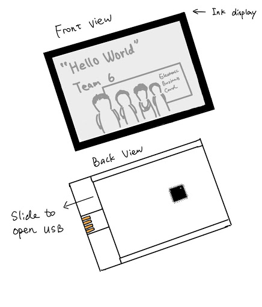
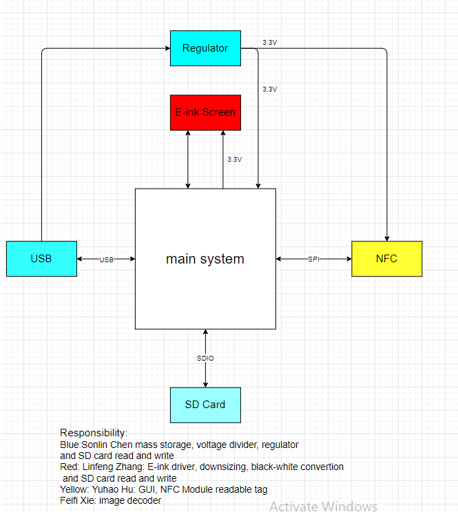
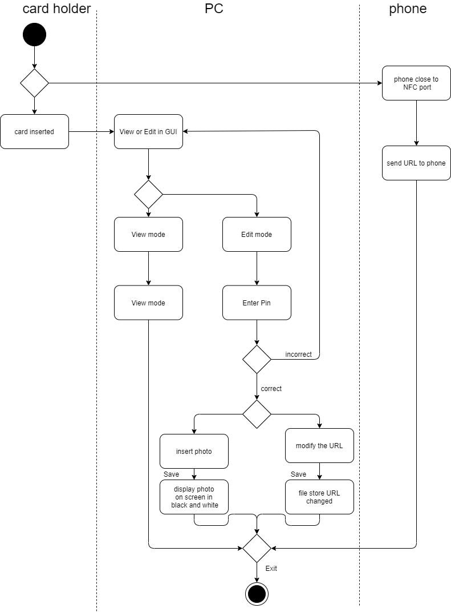
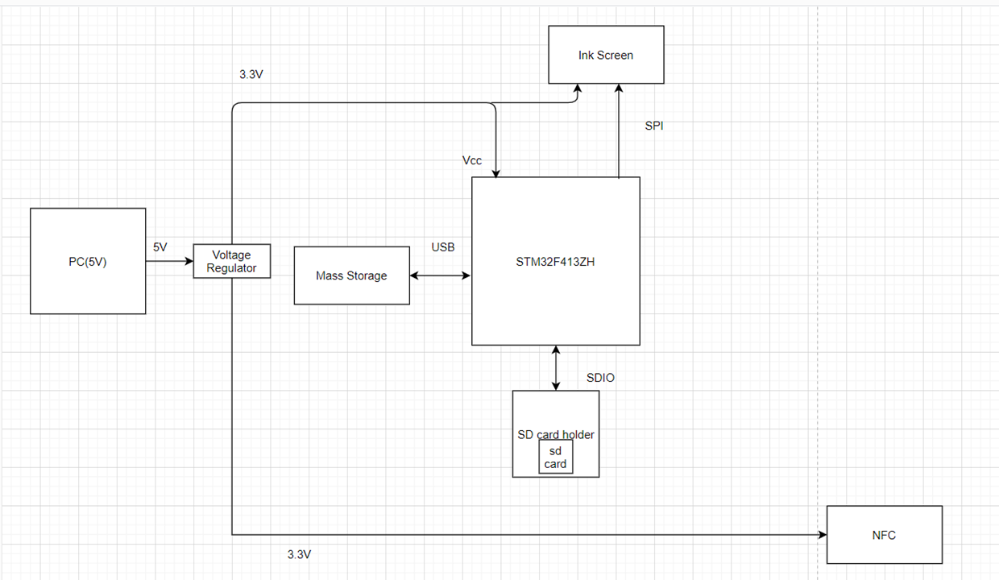
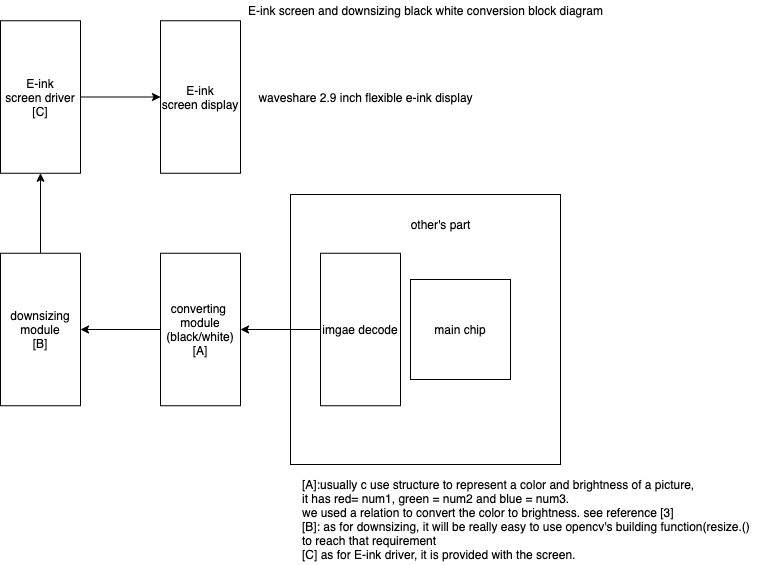
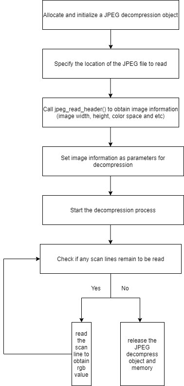
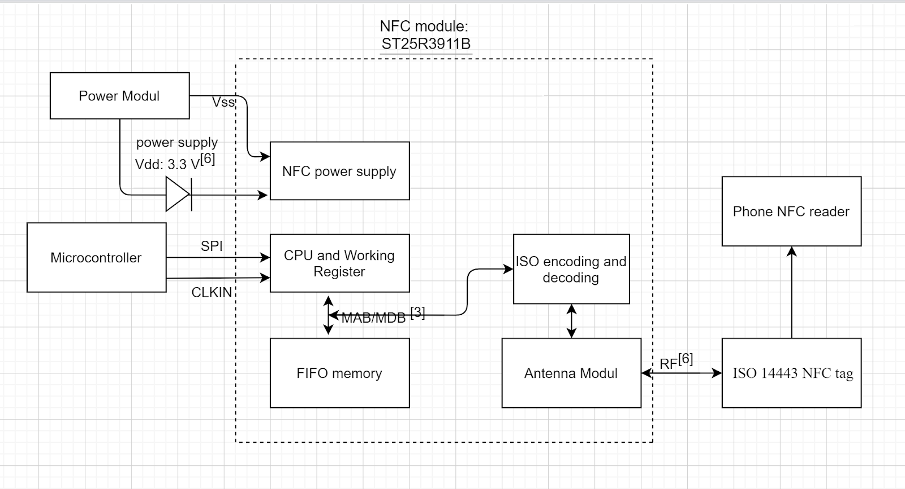

# ECE49022_Senior_Design
E-business card

## Ideal sample

## Introduction
This Senior Design is going to build a Electronic Business Card that can show a 128*128 imgae on screen with some descriptive text.
And it does not require any power supply to driver the screen, once the information on screen has been modified. The E-business card
will have a usb port for user to open a UI windows for user to modify the image and text need to show on screen and the URL to sent
from the NFC module to user's phone. If you are the card owner, you can modify the image and text, when you enter the correct key. Otherwise,
you are only alowed to read the data rather than modify the data. We are using a SD card module, voltage regulator, E-ink Screen, USB mass storage
and NFC module.

## main block diagram

## main system avtivity diagram

## subsystem block diagrams

SD_card:

Screen:

Image_decoder:

NFC:

## Demo Video Link

https://www.youtube.com/watch?v=P2ZDCQjS7qo

## Final Status: 
#### Songlin Chen:
SD card allows users to drag files into it.
Users are able to create files in the SD card. 
SD card can be detected by different devices. 
Files are able to be read. 
Mass storage is acting just like a normal USB memory stick.
Buck converter works fine
Integrating with GUI is in progress. 
#### Yuhao Hu:
UI is able to accept a png or jpeg file and store the pixel_value.txt file to the mass storage.
UI is able to store the url.txt file to the mass storage, but not fully integrate with NFC module to update NFG tag for now. 
 UI allows the user to change files from read to write mode and reset the pin by entering the correct pin.
UI integrates with mass storage and image decode algorithms. 
NFC writer Is able to identify the type and UID of the tag. But not able to write on a type-A T2T NFC tag yet. 
NFC tag can be detected by NFC reader applications on smartphones. 
#### Feidi Xie:
Program be able to compile without linking to library
Program able to generate decoded image data and import a txt file
Finish integration with Yuhao’s UI and be able to compile and generate result by invoking button press event in Yuhao’s UI
Import the result to text file and finish integration with B&W conversion
#### Linfeng Zhang:
Using python to downsizing and convert to grey-scale and black and white
don’t using any additional library
main.c is able to read the decoded black and white image through SD card as a global variable
able to draw provided pixel on screen

### Integration Plan:
UI with mass storage: 
Our mass storage acts like a normal USB drive, all of the UI code can be stored inside of the mass storage. As long as the user has a python installed in his terminal or the user has a python IDE, he would be able to run the UI on his IDE or terminal.
Python has a port extension called pySerial. pySerial provides access to the port settings through Python properties. It will be able to implement the same functionality as the serial modulator to allow serial communication between USB and UART. 

#### UI with NFC
Python has a port extension called pySerial. pySerial provides access to the port settings through Python properties. It will be able to implement the same functionality as the serial modulator to allow serial communication between USB and UART. 

#### Image Decode with UI:
Click the button “save picture” in UI windows twice to invoke the button clicked event and then using the subprocess library in python to compile my program and then import all generated result to a specific text file.

#### Image Decode with B&W conversion:
The output will be three integers in a row corresponding to R, G, B separated by comma. Linfeng can simply open the text file and store each row in a string and then split the string by using separator “,” to obtain R, G, B value orderly.
Image processing 
since image processing is a python file, i decided to integrate with Yuhao’s UI. Once he clicked the save button, it will decode to Feidi’s RGB value and process the downsizing and black and white convention.

#### Data read through file
since the value of the decoded Black and white values are stored in SD card, it requires to read the file through SD card by FATFS.

## Remaining problem
The connection between NFC and main STM32F413ZH is not done

The NFC module cannot write in a correct tag format so that the phone cannot read the information.

*Due to the covid 19, we don't have time to finish this project, but we get a good grade(92.5/100).
